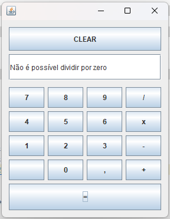
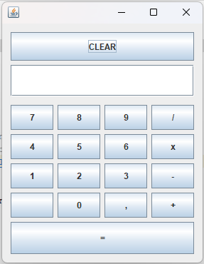

# Calculadora Java Swing

Projeto simples de **calculadora desktop** em Java, construída com **Java Swing**.  
Permite operações básicas:  
- Adição  
- Subtração  
- Multiplicação  
- Divisão  

Com validações de entrada e tratamento de erros:  
- Impede divisão por zero  
- Evita múltiplas vírgulas ou entradas inválidas  
- Informa “Não é possível dividir por zero” em caso de tentativa de divisão por zero  

---

## Estrutura do Projeto

```
calculadora/  
├── build/                ← classes compiladas (via Ant)  
├── src/                  ← código‐fonte Java  
│   └── calculadora/  
│       └── principal.java  
├── build.xml             ← script Ant (compilação, limpeza, execução)  
└── README.md             ← este arquivo  
```

---

## Screenshots do Projeto




## Pré-requisitos

- Java JDK 8 ou superior  
- Apache Ant (opcional, para usar o `build.xml`)  
- [Opcional] IDE (NetBeans, VS Code com Java Extension Pack, Eclipse…)

---

## Como Compilar e Rodar

### Usando Ant

1. Abra um terminal na pasta do projeto.  
2. Para compilar:
   ```bash
   ant compile
   ```
3. Para executar:
   ```bash
   ant run
   ```

### Sem Ant (linha de comando)

1. Compile o código:
   ```bash
   javac -d build/classes src/calculadora/principal.java
   ```
2. Execute:
   ```bash
   java -cp build/classes calculadora.principal
   ```

---

## Uso

1. **Clear:** limpa o display e reseta operações.  
2. **Botões 0–9 e “,”:** montam o número a ser calculado.  
3. **Operadores (+, –, ×, /):** iniciam ou encadeiam operações.  
4. **“=”**: finaliza o cálculo e exibe o resultado.  

---

## Validações

- **Campo vazio:** não permite iniciar operação sem número.  
- **Vírgula duplicada:** impede inserir “,,”.  
- **Divisão por zero:** exibe mensagem de erro no display.  

---

## Observações

- O projeto foi desenvolvido como exercício da disciplina Técnicas de Programação 1.  
- Futura melhoria: uso de `BigDecimal` para maior precisão e encadeamento de operações sem precisar de “=” a cada passo.

---

## Contato

Para dúvidas ou sugestões, abra uma _issue_ ou envie um e-mail para seu.willsf2015@hotmail.com.  
